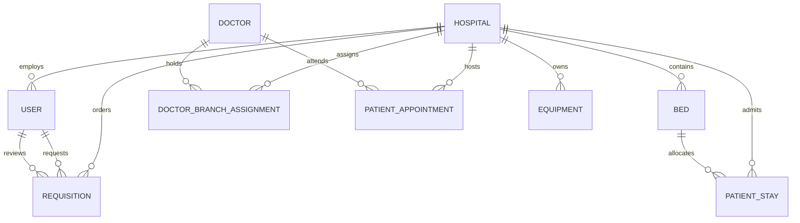

# Product Requirement Document (PRD)
# Medicover Enterprise Multi-Branch Hospital Management & Clinical Operations Platform

**Document Version:** `3.5.0`  
**Status:** `Approved & Implemented`  
**Target Platform:** Web (Desktop / Tablet / Mobile Responsive)  
**Architecture:** Distributed FastAPI Backend + SQLite/PostgreSQL Relational Storage + Vite/React Frontend + Real-Time WebSocket Push Bus  

---

## Table of Contents
1. [Executive Summary & Vision](#1-executive-summary--vision)
2. [Core Architectural Philosophy: "Prevent-vs-Detect"](#2-core-architectural-philosophy-prevent-vs-detect)
3. [Multi-Branch Network Topology (4 Branches)](#3-multi-branch-network-topology-4-branches)
4. [User Personas, Roles & Access Matrix](#4-user-personas-roles--access-matrix)
5. [Detailed Feature Specifications](#5-detailed-feature-specifications)
   - [5.1 Public Zero-Login Patient Appointment Portal](#51-public-zero-login-patient-appointment-portal)
   - [5.2 Master Admin Operations Control Center](#52-master-admin-operations-control-center)
   - [5.3 Head of Department (HOD) Doctor Roster & Duty Hub](#53-head-of-department-hod-doctor-roster--duty-hub)
   - [5.4 Ward Staff Real-Time Bed Operations & Quick Admit](#54-ward-staff-real-time-bed-operations--quick-admit)
   - [5.5 Biomedical Engineering & Pharmacy Operations Center](#55-biomedical-engineering--pharmacy-operations-center)
   - [5.6 Supply & Equipment Procurement Requisition Workflow](#56-supply--equipment-procurement-requisition-workflow)
6. [Data Architecture & Relational Entity Schema](#6-data-architecture--relational-entity-schema)
7. [API Route Specifications & WebSocket Architecture](#7-api-route-specifications--websocket-architecture)
8. [UI/UX Design System (Clean White Medical Theme)](#8-uiux-design-system-clean-white-medical-theme)
9. [Security, Governance & Multi-Tenancy Data Isolation](#9-security-governance--multi-tenancy-data-isolation)
10. [Quick Demo Access Matrix](#10-quick-demo-access-matrix)
11. [Future Roadmap](#11-future-roadmap)

---

## 1. Executive Summary & Vision

The **Medicover Enterprise Multi-Branch Hospital Operations Platform** is a real-time clinical and operational management system designed to orchestrate hospital beds, medical staff, diagnostic workflows, equipment readiness, supply chain procurement, and patient outpatient/inpatient access across multiple hospital branches in a unified digital network.

### Primary Objectives:
- **Zero Friction for Patients**: Enable patients to schedule appointments with specialists in under 60 seconds without requiring account creation, login credentials, or complex forms.
- **Intelligent Specialist Routing**: Automatically match patients to the nearest hospital branch based on their physical city and the **live On-Duty/On-Leave status** of specialists.
- **Unified Hospital Operations**: Provide hospital administrators, HODs, nursing staff, and biomedical technicians with role-specific dashboards synchronized in real time via WebSockets.
- **Eliminate Artificial Data Conflicts**: Replace dual-entry data mismatches with single-source-of-truth operational workflows while detecting genuine clinical/billing discrepancies.

---

## 2. Core Architectural Philosophy: "Prevent-vs-Detect"

Traditional hospital information systems (HIS) suffer from user-induced data fragmentation where nurses or staff are forced to enter the same clinical fact twice (e.g., admitting a patient on an admissions form and separately toggling a bed's status on a bed board).

This platform enforces a strict architectural distinction:

```
+-----------------------------------------------------------------------------------+
|                           PREVENT-VS-DETECT FRAMEWORK                             |
+-----------------------------------------------------------------------------------+
|  1. STRUCTURAL PREVENTION (UX/Design Bugs):                                      |
|     - Problem: App asking the same user to state the same fact twice.             |
|     - Resolution: Quick Admit atomically creates PatientStay and sets Bed to     |
|       'occupied'. Bed Matrix dropdowns ONLY display truly 'available' beds.       |
|       Zero possibility of duplicate allocation or conflicting bed states.         |
|                                                                                   |
|  2. GENUINE DETECTION (Inter-Department Hospital Reality):                        |
|     - Problem: Department A (e.g. Lab) and Department B (e.g. Billing) operate    |
|       asynchronously in real-world hospital life.                                 |
|     - Resolution: Flag genuine discrepancies (e.g. unbilled lab charges upon      |
|       discharge request, physical cleaning pending verification).                 |
+-----------------------------------------------------------------------------------+
```

---

## 3. Multi-Branch Network Topology (4 Branches)

The platform operates across 4 interconnected metropolitan hospital branches with localized ward operations, physical bed inventories, and a shared network of senior specialist doctors:

```
                           +-------------------------------+
                           |      MASTER ADMIN PORTAL      |
                           |  (Hospital-Wide Governance)   |
                           +---------------+---------------+
                                           |
         +-------------------+-------------+-------------+-------------------+
         |                   |                           |                   |
+--------v--------+ +--------v--------+         +--------v--------+ +--------v--------+
|    BRANCH 1     | |    BRANCH 2     |         |    BRANCH 3     | |    BRANCH 4     |
|   Hitech City   | |   Whitefield    |         |   MVP Colony    | |  Navi Mumbai    |
|  (Hyderabad)    | |   (Bengaluru)   |         | (Visakhapatnam) | |   (Mumbai)      |
| Code: MC-HTC    | | Code: MC-BLR    |         | Code: MC-VZP    | | Code: MC-MUM    |
| Beds: 12        | | Beds: 8         |         | Beds: 8         | | Beds: 8         |
+-----------------+ +-----------------+         +-----------------+ +-----------------+
```

### Branch Specifications:
1. **Branch 1 — Hitech City (Hyderabad)** (`MC-HTC`): Plot 12, Hitec City Main Rd, Cyberabad. (Cardiology & Orthopedics Center of Excellence).
2. **Branch 2 — Whitefield (Bengaluru)** (`MC-BLR`): ITPB Main Rd, Whitefield. (Super Specialty Cardiac & Neurosciences).
3. **Branch 3 — MVP Colony (Visakhapatnam)** (`MC-VZP`): Sector 9, MVP Colony. (Coastal Regional Trauma & Surgical Care).
4. **Branch 4 — Navi Mumbai (Mumbai)** (`MC-MUM`): Sector 15, Palm Beach Rd. (Advanced Orthopedics & Critical Care).

---

## 4. User Personas, Roles & Access Matrix

Access is strictly governed using **Cryptographic Role-Based Passkeys** issued by the Master Admin:

| Role Identifier | Role Name | Scope | Key Capabilities |
| :--- | :--- | :--- | :--- |
| `admin` | **Master Administrator** | Hospital-Wide (All Branches) | Master passkey access (`ADMIN-SECURE-2026`), role invite code generation, procurement requisition approvals, equipment monitoring, system audit trail. |
| `hod` | **Head of Department** | Department / Branch | Doctor roster scheduling, OPD room allocation, real-time duty status toggle (`On Duty`, `On Leave`, `Emergency Call`), department bed oversight. |
| `staff` | **Ward Staff / Nurse** | Ward / Branch | Quick patient admission, bed status transitions (`Available`, `Occupied`, `Cleaning Pending`), patient discharge processing. |
| `technician_pharmacist` | **Biomedical Tech & Pharmacist** | Cross-Department | Medical equipment health monitoring (Running Fine, Maintenance, Calibration), pharmacy formulary stock management, supply requisition creation. |
| `public_patient` | **Public Patient** | Public Portal | Zero-login appointment booking, automatic nearest branch matching, digital pass generation. |

---

## 5. Detailed Feature Specifications

### 5.1 Public Zero-Login Patient Appointment Portal
- **Routes**: `/book-appointment`, `/patient-portal`, `/appointments`
- **User Authentication**: None required (frictionless public access).
- **Workflow**:
  1. **Patient Information Capture**: Full name, contact phone, age, gender, city (Hyderabad, Bengaluru, Visakhapatnam, Mumbai), and description of symptoms/illness.
  2. **Intelligent Speciality Detector**: Auto-detects target medical speciality (Cardiology, Orthopedics, Neurology, General Medicine, Pulmonology) based on symptom keywords (e.g. "chest pain" &rarr; Cardiology, "knee fracture" &rarr; Orthopedics) or explicit user selection.
  3. **Duty-Aware Proximity Recommendation Engine**:
     - Evaluates active on-duty specialists across all 4 branches.
     - If the local branch has an on-duty specialist, it is ranked top as **`[RECOMMENDED] Nearest Branch (Local City)`**.
     - If the local doctor is marked **`On Leave`** by the HOD, the system flags the unavailability and dynamically recommends the nearest network branch that has an active on-duty specialist.
  4. **Time Slot Reservation & Token Generation**: The patient selects an available consultation slot (e.g. `10:30 AM`, `02:00 PM`) and confirms.
  5. **Digital Appointment Pass**: Generates a verified digital pass with token ID (e.g., `APT-HTC-9212`), doctor room number, and printable slip.

```
+-----------------------------------------------------------------------------------+
|                         ZERO-LOGIN PATIENT BOOKING FLOW                           |
+-----------------------------------------------------------------------------------+
| [Patient Details & City] ---> [Symptom Analysis] ---> [Doctor Duty Check]         |
|                                                              |                    |
|                                               +--------------v--------------+     |
|                                               | Local Specialist On Duty?   |     |
|                                               +--------------+--------------+     |
|                                                              |                    |
|                                           +----------YES-----+-----NO----------+  |
|                                           |                                    |  |
|                                           v                                    v  |
|                           [Recommend Local Branch]            [Recommend Nearest  |
|                           (Top Badge: Local City)              Alternative Branch]|
|                                           |                                    |  |
|                                           +------------------+-----------------+  |
|                                                              |                    |
|                                                    [Select Time Slot]             |
|                                                              |                    |
|                                                [Generate Digital Pass]            |
|                                                (e.g., APT-HTC-9212)               |
+-----------------------------------------------------------------------------------+
```

---

### 5.2 Master Admin Operations Control Center
- **Component**: `frontend/src/pages/DashboardAdmin.jsx`
- **Features**:
  - **Hospital-Wide KPI Band**: Total occupied beds, active admissions count, average lab turnaround time, and daily inpatient run-rate revenue.
  - **Department Bed Occupancy Matrix**: Real-time breakdown of Cardiology, Orthopedics, and ICU beds with status indicators (Available, Occupied, Cleaning).
  - **Procurement & Supply Requisitions Widget**: Real-time review and approval interface for equipment orders and pharmaceuticals raised by technicians.
  - **Biomedical Equipment Health Widget**: Live operational rate gauge and list of devices currently undergoing maintenance or calibration.
  - **Passkey Generation & Management**: Secure tool to generate branch-specific, role-bound invite passkeys.

---

### 5.3 Head of Department (HOD) Doctor Roster & Duty Hub
- **Component**: `frontend/src/components/HODDoctorRosterWidget.jsx`
- **Features**:
  - **Live Duty Toggles**: 1-click status switching between `on_duty`, `on_leave`, and `emergency_on_call`.
  - **OPD Room & Shift Assignment**: Modal to configure doctor consultation suites (e.g. `OPD Suite 102`) and shift timings (e.g. `09:00 AM - 02:00 PM`).
  - **Incoming Patient Appointments Stream**: Live queue displaying booked patient appointments, symptom summaries, and assigned time slots.
  - **Instant WebSocket Synchronization**: Duty toggles broadcast immediately across the network and adjust availability in the Patient Booking Portal.

---

### 5.4 Ward Staff Real-Time Bed Operations & Quick Admit
- **Component**: `frontend/src/pages/DashboardStaff.jsx` & `frontend/src/components/QuickAdmitModal.jsx`
- **Features**:
  - **Live Bed Operations Matrix**: Interactive grid showing all ward beds with instant state transitions (`available` &rarr; `occupied` &rarr; `cleaning_pending` &rarr; `available`).
  - **Atomic Quick Admit**: Selects an available bed, inputs patient details, and atomically transitions bed status to `occupied` in a single transaction.
  - **Patient Ward Directory**: Complete listing of currently admitted inpatients with length-of-stay tracking and discharge triggers.

---

### 5.5 Biomedical Engineering & Pharmacy Operations Center
- **Component**: `frontend/src/pages/DashboardTechPharmacy.jsx` & `frontend/src/components/EquipmentGrid.jsx`
- **Theme**: Clean White-Based Medical Design System.
- **Features**:
  - **Biomedical Equipment Matrix**: Comprehensive asset register with filters by status (`Running Fine`, `Under Maintenance`, `Calibration Due`, `Out of Order`) and location room.
  - **In-Place Status Editor**: Modal for technicians to update device operating states and append maintenance/inspection notes.
  - **Pharmacy Formulary Inventory**: Real-time monitoring of critical inpatient pharmaceuticals (e.g., IV Paracetamol, Enoxaparin, Meropenem) with minimum stock alert thresholds.
  - **Clinical Activity Audit Trail**: Timestamped logs of all equipment inspections and status transitions.

---

### 5.6 Supply & Equipment Procurement Requisition Workflow
- **Components**: `RequisitionOrderModal.jsx` & `AdminRequisitionWidget.jsx`
- **Features**:
  - **Requisition Initiation**: Technicians/Pharmacists raise orders specifying item classification (`Medical Equipment`, `Medicines/Pharmacy`, `Surgical Consumables`), quantity, estimated cost, and urgency (`Routine`, `Urgent`, `Emergency`).
  - **Admin Approval Queue**: Master Admin reviews pending requisitions, enters approval/rejection remarks, and confirms procurement.
  - **Real-Time Notification**: Instant status update delivered to technician dashboards upon admin decision.

---

## 6. Data Architecture & Relational Entity Schema

The database architecture is implemented in SQLAlchemy with foreign key constraints, indexing, and strict enums:



### Entity Definitions:

#### 1. `hospitals`
- `id`: Integer (Primary Key)
- `name`: String(150), Unique
- `branch_code`: String(20), Unique (e.g., `MC-HTC`)
- `city`: String(50) (e.g., `Hyderabad`)
- `latitude` / `longitude`: Float
- `phone` / `emergency_contact`: String(30)
- `is_active`: Boolean

#### 2. `doctors`
- `id`: Integer (Primary Key)
- `full_name`: String(100) (e.g., `Dr. Ananya Rao`)
- `speciality`: String(100) (e.g., `Cardiology`)
- `qualification`: String(100) (e.g., `MBBS, MD, DM (Cardiology)`)
- `experience_years`: Integer
- `consultation_fee`: Float

#### 3. `doctor_branch_assignments`
- `id`: Integer (Primary Key)
- `doctor_id`: FK &rarr; `doctors.id`
- `hospital_id`: FK &rarr; `hospitals.id`
- `department`: String(100)
- `duty_status`: Enum (`on_duty`, `on_leave`, `emergency_on_call`)
- `room_number`: String(50)
- `shift_timings`: String(100)
- `available_days`: String(100)

#### 4. `patient_appointments`
- `id`: Integer (Primary Key)
- `token_number`: String(50), Unique (e.g., `APT-HTC-9212`)
- `patient_name`: String(100)
- `patient_phone`: String(30)
- `patient_age` / `patient_gender`: Integer / String(20)
- `illness_description`: Text
- `target_speciality`: String(100)
- `hospital_id`: FK &rarr; `hospitals.id`
- `doctor_id`: FK &rarr; `doctors.id`
- `appointment_date`: Date
- `time_slot`: String(30)
- `status`: Enum (`confirmed`, `completed`, `cancelled`)

#### 5. `equipments`
- `id`: Integer (Primary Key)
- `hospital_id`: FK &rarr; `hospitals.id`
- `asset_tag`: String(50), Unique (e.g., `EQ-CARD-001`)
- `equipment_name`: String(150)
- `category`: String(100)
- `department`: String(100)
- `location_room`: String(100)
- `status`: Enum (`operational`, `maintenance`, `calibrating`, `decommissioned`)
- `maintenance_notes`: Text
- `last_inspected_at`: DateTime

#### 6. `requisitions`
- `id`: Integer (Primary Key)
- `hospital_id`: FK &rarr; `hospitals.id`
- `requested_by_id`: FK &rarr; `users.id`
- `item_type`: Enum (`equipment`, `medicine`, `consumable`)
- `item_name`: String(150)
- `quantity`: Integer
- `unit`: String(50)
- `urgency`: Enum (`routine`, `urgent`, `emergency`)
- `estimated_cost`: Float
- `status`: Enum (`pending`, `approved`, `rejected`, `ordered`, `delivered`)
- `admin_notes`: Text

---

## 7. API Route Specifications & WebSocket Architecture

### REST Endpoints:

| Method | Endpoint | Access | Purpose |
| :--- | :--- | :--- | :--- |
| `GET` | `/api/hospitals` | Public | List all 4 branches with live bed and on-duty doctor metrics. |
| `POST` | `/api/appointments/recommend` | Public | Proximity and doctor duty recommendation engine for patient booking. |
| `POST` | `/api/appointments/book` | Public | Zero-login patient appointment booking and digital pass creation. |
| `GET` | `/api/doctors` | Public | Retrieve directory of specialist doctors. |
| `GET` | `/api/doctors/assignments` | Authenticated | Retrieve doctor assignments filtered by hospital and department. |
| `PATCH` | `/api/doctors/assignments/{id}/duty-status` | HOD / Admin | Update doctor duty status (`on_duty`, `on_leave`, `emergency_on_call`). |
| `GET` | `/api/equipments` | Authenticated | Retrieve biomedical equipment inventory with health status. |
| `PATCH` | `/api/equipments/{id}/status` | Tech / Admin | Update equipment operating state and maintenance logs. |
| `GET` | `/api/requisitions` | Authenticated | List procurement requisitions. |
| `POST` | `/api/requisitions` | Tech / Pharmacist | Raise new supply/equipment procurement order. |
| `PATCH` | `/api/requisitions/{id}/status` | Admin | Approve or reject procurement requisition with remarks. |
| `GET` | `/api/beds` | Authenticated | Retrieve live bed operations matrix. |
| `PATCH` | `/api/beds/{id}/status` | Staff / Admin | Atomically update bed status (`available`, `occupied`, `cleaning_pending`). |
| `POST` | `/api/patient-stays` | Staff / Admin | Quick Admit workflow allocating patient to bed. |
| `POST` | `/api/invite-codes` | Admin | Generate new role-specific passkey. |

### Real-Time WebSocket Push Bus:
- **Endpoint**: `/ws/events`
- **Broadcast Events**:
  - `BED_STATUS_CHANGED`: Pushes real-time occupancy updates to all dashboards.
  - `DOCTOR_DUTY_CHANGED`: Pushes duty roster updates and recalculates public booking slots.
  - `REQUISITION_CREATED` / `REQUISITION_UPDATED`: Triggers instant approval notifications.
  - `EQUIPMENT_STATUS_CHANGED`: Syncs device health across Admin and Technician views.

---

## 8. UI/UX Design System (Clean White Medical Theme)

The user interface follows a **Clean White Medical Design System** designed for high clinical legibility, fast responsiveness, and premium aesthetics:

- **Color Palette**:
  - Canvas: Pure White (`#FFFFFF`) and Soft Slate Surface (`#F8FAFC`).
  - Primary Brand: Clinical Navy (`#0A2540`) & Royal Blue (`#2563EB`).
  - Operational Green: Emerald (`#059669` / `#ECFDF5`).
  - Maintenance Warning: Amber (`#D97706` / `#FFFBEB`).
  - Calibration Info: Cyan (`#0891B2` / `#ECFEFF`).
  - Critical / Emergency: Crimson Rose (`#DC2626` / `#FEF2F2`).
- **Typography**: Inter / Outfit sans-serif typeface hierarchy.
- **Card Aesthetics**: 24px/32px rounded pill borders (`rounded-3xl`), subtle `1px` slate borders (`border-slate-200/80`), and light diffuse shadows (`shadow-xs` / `shadow-sm`).

---

## 9. Security, Governance & Multi-Tenancy Data Isolation

1. **Authentication**: Stateless JSON Web Tokens (JWT) with configurable session persistence.
2. **Master Admin Governance**: Single master passkey (`ADMIN-SECURE-2026`) enables enterprise-wide administrative capabilities across all 4 branches.
3. **Branch Multi-Tenancy**: Clinical records, bed allocations, and staff permissions are logically isolated by `hospital_id`.
4. **Audit Trail**: Every critical state transition (admissions, duty updates, status changes, passkey generation) is logged to the `activity_logs` table with actor metadata and timestamp.

---

## 10. Quick Demo Access Matrix

For frictionless evaluation, the login gateway provides **1-Click Instant Demo Authentication**:

| Role | Hospital Branch | Email | Password | Passkey Code |
| :--- | :--- | :--- | :--- | :--- |
| **Master Admin** | All 4 Branches | `admin@medicover.com` | `Password@123` | `ADMIN-SECURE-2026` |
| **HOD Cardiology** | Hitech City (Hyderabad) | `hod.cardio@medicover.com` | `Password@123` | `HOD-DEPT-2026` |
| **HOD Orthopedics** | Hitech City (Hyderabad) | `hod.ortho@medicover.com` | `Password@123` | `HOD-DEPT-2026` |
| **Ward Staff** | Hitech City (Hyderabad) | `staff.cardio1@medicover.com` | `Password@123` | `STAFF-OP-2026` |
| **Biomedical & Pharmacist** | Hitech City (Hyderabad) | `tech.pharmacist@medicover.com` | `Password@123` | `TECH-PHARM-2026` |
| **Housekeeping Staff** | Hitech City (Hyderabad) | `staff.housekeeping@medicover.com` | `Password@123` | `STAFF-OP-2026` |
| **HOD Cardiology** | Whitefield (Bengaluru) | `hod.cardio.blr@medicover.com` | `Password@123` | `BLR-HOD-2026` |
| **HOD Cardiology** | MVP Colony (Visakhapatnam) | `hod.cardio.vzp@medicover.com` | `Password@123` | `VZP-HOD-2026` |
| **HOD Orthopedics** | Navi Mumbai (Mumbai) | `hod.ortho.mum@medicover.com` | `Password@123` | `MUM-HOD-2026` |
| **Public Patients** | Any Branch | *No login or password needed* | — | `/book-appointment` |

---

## 11. Future Roadmap

1. **AI-Driven Clinical Triage**: Natural language parsing of patient symptoms using Gemini API to calculate urgency scores prior to doctor consultation.
2. **Automated Equipment Telemetry**: IoT integration with multiparameter patient monitors and ventilators for automated sensor calibration alerts.
3. **HL7 / FHIR Interoperability**: Bi-directional data exchange with external diagnostic labs and government health registries (ABDM / Ayushman Bharat).
4. **Patient Tele-Consultation**: WebRTC video consultation embedded directly within the digital appointment pass.
