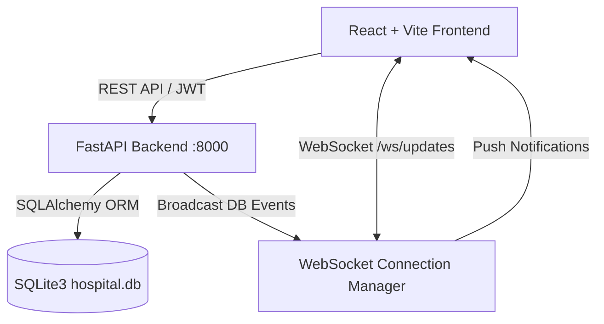

# Implementation Plan: Unified Hospital Operations Platform (Phase 1)

Build the complete Phase 1 foundation for a multi-department Hospital Operations Platform featuring centralized SQLite database, SQLAlchemy ORM models with `hospital_id` multi-tenancy, JWT auth with bcrypt and role invite code verification, WebSocket real-time event broadcasting, and responsive React (Vite) + Tailwind CSS dashboards for Admin, HOD, and Staff roles.

## User Review Required

> [!NOTE]
> - **Default Demo Credentials & Invite Codes**: We will seed realistic demo accounts (`admin@medicover.com`, `hod.cardio@medicover.com`, `hod.ortho@medicover.com`, `staff.cardio1@medicover.com`, etc., default password `Password@123`) and invite codes (`ADMIN-SECURE-2026`, `HOD-DEPT-2026`, `STAFF-OP-2026`).
> - **Console Password Reset**: As requested, password reset will generate an unexpired reset token stored in SQLite and log the reset link to the server console/API response for local simulation.

## Proposed Architecture

### Multi-Hospital Schema Design
Every operational model will carry `hospital_id` as foreign key:
1. `Hospital`: `id`, `name`, `address`, `state`, `created_at`
2. `User`: `id`, `hospital_id`, `full_name`, `email`, `password_hash`, `role` (admin, hod, staff), `department`, `is_active`, `created_at`
3. `RoleInviteCode`: `id`, `hospital_id`, `role`, `code_hash`, `created_by`, `is_active`
4. `PasswordResetToken`: `id`, `user_id`, `token`, `expires_at`, `used`
5. `Bed`: `id`, `hospital_id`, `ward`, `department`, `room_type` (single, double, triple, icu), `price_per_day`, `current_status` (available, occupied, reserved, maintenance), `last_updated_by`, `last_updated_at`
6. `PatientStay`: `id`, `hospital_id`, `patient_name`, `patient_ref_id`, `bed_id`, `admitted_at`, `expected_discharge_at`, `actual_discharge_at`, `status` (active, discharged), `admitted_by`
7. `Billing`: `id`, `hospital_id`, `stay_id`, `status` (not_started, active, closed), `total_amount`, `last_updated_at`
8. `LabOrder`: `id`, `hospital_id`, `stay_id`, `test_name`, `ordered_at`, `sample_collected_at`, `result_at`, `status` (pending, in_progress, completed), `billed`
9. `ConflictLog`: `id`, `hospital_id`, `conflict_type`, `related_stay_id`, `related_bed_id`, `description`, `detected_at`, `status` (open, under_review, resolved), `assigned_to`
10. `ActivityLog`: `id`, `hospital_id`, `user_id`, `action_description`, `timestamp`

---

## Proposed Changes

### Backend (`/backend`)
- **[NEW] `backend/requirements.txt`**: `fastapi`, `uvicorn[standard]`, `sqlalchemy`, `pydantic`, `pydantic-settings`, `passlib[bcrypt]`, `bcrypt`, `pyjwt`, `python-multipart`, `websockets`.
- **[NEW] `backend/app/core/config.py`**: Settings for JWT, DB URL, CORS origins.
- **[NEW] `backend/app/core/database.py`**: SQLite engine and scoped SessionLocal.
- **[NEW] `backend/app/core/security.py`**: Password hashing, invite code hashing, JWT creation/verification.
- **[NEW] `backend/app/models/`**: SQLAlchemy models for all 10 entities.
- **[NEW] `backend/app/schemas/`**: Pydantic v2 schemas for request/response validation.
- **[NEW] `backend/app/services/websocket_manager.py`**: Connection manager supporting hospital & department scoped channels.
- **[NEW] `backend/app/services/activity_service.py`**: Helper to write audit trail in `ActivityLog` and broadcast.
- **[NEW] `backend/app/routes/`**:
  - `auth.py`: `/login`, `/signup` (with invite code check), `/forgot-password`, `/reset-password`, `/me`
  - `beds.py`: List beds (with dept/ward filtering), update bed status (with websocket broadcast & activity log)
  - `stays.py`: List active/all stays
  - `labs.py`: List lab orders, update status (sample collected, completed) with timestamps
  - `billing.py`: List billing summaries
  - `conflicts.py`: List data conflict records
  - `activity.py`: List activity logs
  - `dashboard.py`: Role-specific aggregate statistics (Admin revenue & turnaround times, HOD department metrics, Staff queue)
  - `websocket.py`: WebSocket endpoint `/ws/updates` with JWT authentication
- **[NEW] `backend/app/seed/seed_data.py`**: Full database seeder with ~20 beds across 4 room types, 7 users, stays, billings, lab orders, and dummy conflict logs.
- **[NEW] `backend/app/main.py`**: FastAPI entrypoint with CORS, route mounting, and lifecycle events.

---

### Frontend (`/frontend`)
- **[NEW] `frontend/package.json`**: React 18, Vite, Tailwind CSS, Lucide-react, Axios, React-router-dom.
- **[NEW] `frontend/src/api/`**: API clients for auth, beds, stays, labs, conflicts, and dashboards.
- **[NEW] `frontend/src/hooks/useAuth.jsx` & `useWebSocket.jsx`**: Global auth context and real-time event listener with automatic reconnection and widget refresher callbacks.
- **[NEW] `frontend/src/components/`**:
  - `Header.jsx`: Hospital branding, live WS connection status pulse, user info, logout.
  - `StatCard.jsx`: Metric cards with financial, count, and status indicators.
  - `BedGrid.jsx`: Visual, color-coded bed map with instant status switcher dialog.
  - `ConflictPanel.jsx`: Visual conflict tracker displaying open conflicts & revenue at risk.
  - `PatientStaysList.jsx`: Department and hospital-wide patient encounter list.
  - `LabOrdersList.jsx`: Interactive lab order tracker with one-click status transitions.
  - `ActivityFeed.jsx`: Live audit trail of department and hospital actions.
  - `StaffManagementList.jsx`: Admin staff and HOD roster view.
  - `LiveNotificationToast.jsx`: Real-time notification banners when DB changes occur.
- **[NEW] `frontend/src/pages/`**:
  - `Login.jsx`: Login with convenient demo credentials auto-fill selector.
  - `Signup.jsx`: Role-based signup requiring matching invite codes.
  - `ForgotPassword.jsx` & `ResetPassword.jsx`: Simulated token-based password reset.
  - `DashboardAdmin.jsx`: Executive overview with revenue at risk, turnaround times, bed distribution, conflicts, and staff activity.
  - `DashboardHOD.jsx`: Departmental view with bed grid, occupancy stats, active stays, labs, and conflict logs.
  - `DashboardStaff.jsx`: Actionable workflow dashboard with quick bed status updater, department stays, and lab order processing.
- **[NEW] `README.md`**: Comprehensive installation, seed, and running instructions.

---

## Verification Plan

### Automated Verification
1. **Backend seed execution**: `python -m app.seed.seed_data` -> check `hospital.db` tables and row counts.
2. **Backend API test suite**: Run python test script verifying:
   - Login, invalid credentials, signup with invalid invite code (rejected), signup with valid invite code (accepted).
   - Forgot password & reset password token validation.
   - Role-based authorization (staff attempting admin endpoint blocked).
   - Bed status update triggering activity log and broadcast notification.
   - Lab order status updates with timestamp recording.
   - Dashboard endpoints for Admin, HOD, and Staff.

### Real-Time WebSocket Verification
- Connect test WebSocket client, execute a bed status update via REST API, verify WebSocket receives `{ "table": "Bed", "action": "update", "id": ... }` in real-time.

### Frontend Browser Verification
- Build and run Vite frontend.
- Log in as Admin, HOD (Cardiology), and Staff (Cardiology).
- Test changing bed status from Staff dashboard and seeing real-time update in Admin/HOD dashboards without page refresh.
- Verify clear error messages on wrong signup invite codes and password resets.
